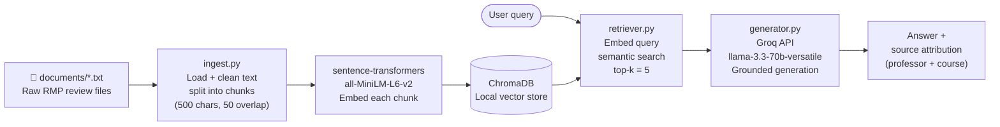

# Project 1 Planning: The Unofficial Guide

> Write this document before you write any pipeline code.
> Your spec and architecture diagram are what you'll use to direct AI tools (Claude, Copilot, etc.) to generate your implementation — the more specific they are, the more useful the generated code will be.
> Update the Retrieval Approach and Chunking Strategy sections if you change your approach during implementation.
> Update this file before starting any stretch features.

---

## Domain

Rate My Professors reviews for Notre Dame CSE (Computer Science & Engineering) department professors. This knowledge is valuable because official course descriptions and university websites say nothing about actual teaching style, workload, exam difficulty, grading fairness, or how accessible a professor is outside class — yet those factors have a huge impact on a student's semester. Students rely on word-of-mouth or hours of scrolling RMP; this system makes that distributed knowledge instantly searchable and answerable.

---

## Documents

<!-- List your specific sources: URLs, subreddit names, forum threads, or file descriptions.
     Aim for at least 10 sources that together cover different subtopics or perspectives within your domain. -->

| # | Source | Description | URL or location |
|---|--------|-------------|-----------------|
| 1 | RMP – Daniel Cedre | 14 reviews across CSE10001 (Intro to CS) and CSE20110 (Discrete Math). Overall 2.4/5. | https://www.ratemyprofessors.com/professor/2935650 |
| 2 | RMP – Shreya Kumar | 10 reviews across CSE10001, EG10118, CSE30332, CSE40793, EG10112. Overall 3.2/5. | https://www.ratemyprofessors.com/professor/2551877 |
| 3 | RMP – Daniel Rehberg | 1 review for CSE20232 (Data Structures). Overall 1/5. | https://www.ratemyprofessors.com/professor/3152860 |
| 4 | RMP – Douglas Thain | 4 reviews across CSE30341 (OS) and CSE40771 (Distributed Systems). Overall 4/5. | https://www.ratemyprofessors.com/professor/2441081 |
| 5 | RMP – Katherine Walden | 5 reviews for CDT30010 (Computing & Digital Technologies). Overall 5/5. | https://www.ratemyprofessors.com/professor/2748451 |
| 6 | RMP – Ramzi Bualuan | 7 reviews for CSE20311 (Fundamentals of Computing). Overall 5/5. | https://www.ratemyprofessors.com/professor/2647156 |
| 7 | RMP – Peter Bui | 15 reviews across CSE20289 (Systems Programming) and CSE30341 (OS). Overall 4.5/5. | https://www.ratemyprofessors.com/professor/2539366 |
| 8 | RMP – Tijana Milenkovic | 6 reviews across CSE20110 (Discrete Math) and CSE20111 (Algorithms). Overall 2.3/5. | https://www.ratemyprofessors.com/professor/2054522 |
| 9 | RMP – Matthew Morrison | 12 reviews across CSE20312, CSE20133, CSE30321, CSE40462. Overall 3.1/5. | https://www.ratemyprofessors.com/professor/2484735 |
| 10 | RMP – Fred Nwanganga | 15 reviews for ITAO20210 (Intro to Python, Mendoza). Overall 4.4/5. | https://www.ratemyprofessors.com/professor/2675949 |

---

## Chunking Strategy

<!-- How will you split documents into chunks?
     State your chunk size (in tokens or characters), overlap size, and explain why those
     numbers fit the structure of your documents.
     A review-heavy corpus warrants different chunking than a long FAQ. -->

**Chunk size:** 500 characters

**Overlap:** 50 characters

**Final chunk count:** 131 chunks across 10 documents (89 source reviews). Some reviews are short enough to fit in one chunk; longer reviews produce 2 chunks via the overlap splitter.

**Reasoning:** Each RMP review is a self-contained opinion block roughly 100–500 characters long (2–6 sentences plus metadata fields like course, grade, and attendance). A 500-character chunk is large enough to hold one full review in most cases, so a chunk typically captures a single student's complete take on a professor — including the context (which course, what grade) and the opinion together. Going smaller (e.g., 150 characters) would split a review's context fields from the opinion text, making the chunk uninterpretable on its own. Going larger (e.g., 1,000 characters) would merge two reviews into one chunk, muddying attribution and making it harder to surface professor-specific signals. A 50-character overlap ensures that if a review straddles a boundary, the key sentiment at the edge of one chunk also appears at the start of the next, so neither chunk loses the conclusion of the thought.

---

## Retrieval Approach

<!-- Which embedding model are you using (e.g., all-MiniLM-L6-v2 via sentence-transformers)?
     How many chunks will you retrieve per query (top-k)?
     If you were deploying this for real users and cost wasn't a constraint, what tradeoffs
     would you weigh in choosing a different embedding model — context length, multilingual
     support, accuracy on domain-specific text, latency? -->

**Embedding model:** `all-MiniLM-L6-v2` via `sentence-transformers` (runs locally, no API key required)

**Top-k:** 5

**Production tradeoff reflection:** `all-MiniLM-L6-v2` is a strong default for short, opinion-based text — it's fast, runs locally (no cost, no latency from API calls), and handles the informal, colloquial language of student reviews well. For a real deployment, the main tradeoffs to weigh would be: (1) **accuracy vs. speed** — `all-mpnet-base-v2` produces meaningfully better embeddings on semantic similarity benchmarks but is ~3× slower and larger; for a low-latency interface that tradeoff may not be worth it. (2) **domain specificity** — a model fine-tuned on educational or review text would likely outperform a general-purpose model on queries like "easy grader" or "accessible outside class," which use domain jargon that general models may embed imprecisely. (3) **context length** — `all-MiniLM-L6-v2` has a 256-token limit, sufficient for our 500-character chunks (~125 tokens) but would truncate longer documents. (4) **API vs. local** — OpenAI's `text-embedding-3-small` would offer higher accuracy but adds cost, rate limits, and a network dependency; for a student tool with unpredictable usage, local is more robust.

---

## Evaluation Plan

<!-- List your 5 test questions with their expected correct answers.
     Questions should be specific enough that you can judge whether the system's response
     is right or wrong. "What are good dining halls?" is too vague.
     "What do students say about wait times at [dining hall name] during lunch?" is testable. -->

| # | Question | Expected answer |
|---|----------|-----------------|
| 1 | What is Katherine Walden's grading system in CDT30010? | Contract grading: students commit to a grade tier and earn it by meeting requirements (submitting a set number of assignments on time, limiting absences). Assignments are pass/fail with two attempts. No traditional exams. |
| 2 | How hard are Peter Bui's exams in Systems Programming (CSE20289)? | Multiple reviews describe them as very hard or "impossible" even with open notes, worth 60 points total, capable of dropping a full letter grade per ~10 points lost. Extra credit is available and strongly recommended. |
| 3 | Does Daniel Cedre require office hours to pass CSE10001? | Yes — multiple reviews state that homework assignments cannot be completed using only lecture knowledge and that students effectively must attend office hours to finish problem sets. |
| 4 | What do students say about Tijana Milenkovic's grading strictness in Discrete Math? | She is described as a tough/harsh grader who penalizes small notation errors heavily, especially in the first half of the semester, and does not offer extra credit to recover lost points. |
| 5 | Is Ramzi Bualuan recommended for students with no prior CS experience? | Yes — reviews consistently describe him as accessible, engaging, and good at building CS foundations for beginners, though the class is project-heavy and requires real effort. |

---

## Anticipated Challenges

<!-- What could go wrong? Name at least two specific risks with reasoning.
     Consider: noisy or inconsistent documents, missing source attribution, off-topic
     retrieval, chunks that split key information across boundaries. -->

1. **Metadata separated from opinion text at chunk boundaries.** Each review in the `.txt` files has several header lines (course code, date, grade, attendance) before the opinion paragraph. If a 500-character chunk boundary falls between the header and the opinion text, one chunk will contain only metadata with no opinion, and the adjacent chunk will contain opinion text with no professor or course context. A query like "What do students think of Cedre in CSE10001?" might retrieve the opinion chunk, which contains no course name, making source attribution in the generated response ambiguous. Mitigation: prepend the professor name and course code to every chunk during ingestion.

2. **Sparse coverage for some professors makes retrieval unreliable.** Rehberg has only 1 review and Thain has 4. For queries targeting those professors, the system may return chunks from higher-reviewed professors simply because those chunks score above the sparse Rehberg/Thain entries under semantic similarity. The system could then answer "What is Rehberg like?" using Cedre or Morrison reviews instead. Mitigation: always surface the source document name in every response so users can see which professor the answer actually draws from.

3. **Two professors teach the same course (CSE20110 Discrete Math).** Both Cedre and Milenkovic teach Discrete Math. A query like "Is Discrete Math at Notre Dame hard?" will retrieve reviews about both professors mixed together, and the generated answer may conflate two very different teaching experiences without distinguishing who is being described. Mitigation: include professor name prominently in each chunk and instruct the LLM to cite professor names when drawing from multiple sources.

---

## Architecture

---

## AI Tool Plan

<!-- For each part of the pipeline below, describe:
     - Which AI tool you plan to use (Claude, Copilot, ChatGPT, etc.)
     - What you'll give it as input (which sections of this planning.md, which requirements)
     - What you expect it to produce
     - How you'll verify the output matches your spec

     "I'll use AI to help me code" is not a plan.
     "I'll give Claude my Chunking Strategy section and ask it to implement chunk_text()
     with my specified chunk size and overlap" is a plan. -->

**Milestone 3 — Ingestion and chunking (`ingest.py`):**
I will give GitHub Copilot the Chunking Strategy section of this file (chunk size: 500 chars, overlap: 50 chars) along with an example `.txt` document showing the structure (professor header, `---` separators between reviews, course/date/grade metadata fields, opinion text, tags). I'll ask it to implement a `load_and_chunk_documents(docs_dir)` function that reads every `.txt` file from `documents/`, prepends the professor name and course code to each chunk for attribution, and returns a list of dicts with keys `{text, source, professor, course}`. I'll verify the output by printing the first 10 chunks and confirming each contains both metadata context and opinion text, and that no chunk is under 50 or over 600 characters.

**Milestone 4 — Embedding and retrieval (`retriever.py`):**
I will give GitHub Copilot the Retrieval Approach section (model: `all-MiniLM-L6-v2`, top-k: 5, store: ChromaDB) plus the Architecture diagram above as context. I'll ask it to implement `embed_and_store(chunks)` (loads chunks into ChromaDB with metadata) and `retrieve(query, k=5)` (embeds the query and returns the top-k matching chunks with their source metadata). I'll verify by running all 5 evaluation plan queries and confirming that at least 4 of 5 return chunks from the expected professor before moving to generation.

**Milestone 5 — Generation and interface:**
I will give GitHub Copilot the Grounded Generation section of this file (model: `llama-3.3-70b-versatile` via Groq, grounding instruction, temperature: 0.2, top-k: 5) and ask it to implement `ask(question, k=5)` in `generator.py` that (1) retrieves the top-k chunks via `retrieve()`, (2) formats them as numbered context blocks labeled with professor and course, (3) calls the Groq API with a strict system prompt preventing outside-knowledge use, and (4) returns `{answer, sources, chunks}` where sources are extracted programmatically from chunk metadata. For `app.py`, I'll give it the interface description and ask it to build a Gradio `gr.Blocks()` UI with a question input, submit button, answer output, and sources panel. I'll verify by (1) running the 5 evaluation queries and confirming grounded answers with correct source attribution, and (2) testing an out-of-scope question to confirm the refusal response fires correctly.
